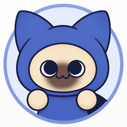
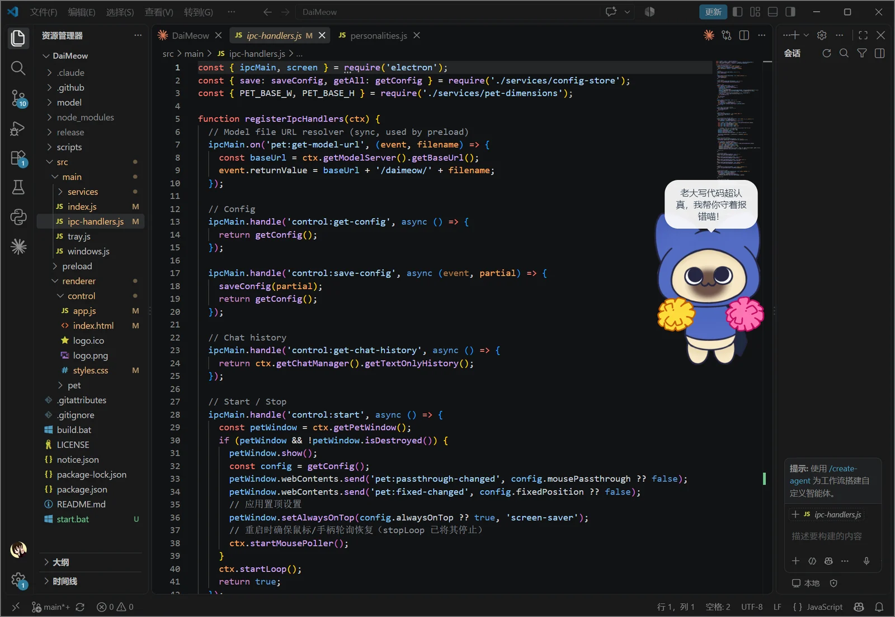
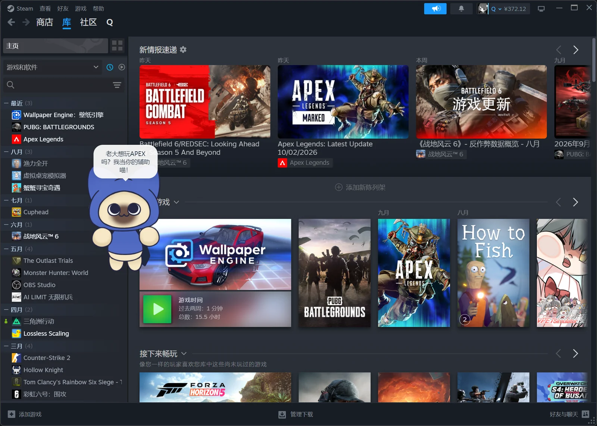
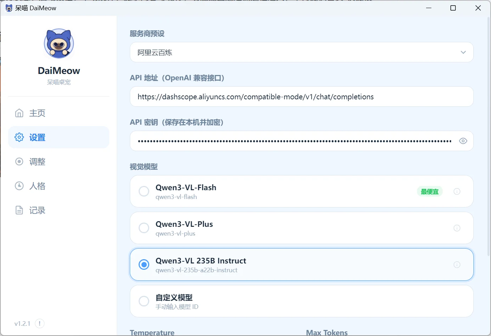

<div align="center">



[](https://github.com/yubdey/DaiMeow/actions/workflows/build.yml)
[](https://github.com/yubdey/DaiMeow/actions/workflows/build-release.yml)
[](https://github.com/yubdey/DaiMeow/releases)

# 呆喵 DaiMeow

**一只会陪你看屏幕的《怪物猎人》艾露猫桌宠**

基于 Electron + Live2D 的 Windows 桌面宠物。呆喵常驻屏幕角落，会定时「看」你的屏幕，用多模态大模型以艾露猫的身份（称呼你为「老大」喵~）点评你在做什么。

</div>

---

## 📸 实机演示

<table>
  <tr>
    <td width="50%">
      
      <br><sub>看视频时陪你一起吐槽</sub>
    </td>
    <td width="50%">
      
      <br><sub>写代码时帮你看着报错</sub>
    </td>
  </tr>
  <tr>
    <td width="50%">
      
      <br><sub>逛游戏库时给出陪玩建议</sub>
    </td>
    <td width="50%">
      
      <br><sub>配置服务商和视觉模型</sub>
    </td>
  </tr>
</table>

---

## ✨ 功能特点

- **Live2D 桌宠渲染**：透明无边框置顶窗口，Cubism 3 模型实时渲染，常驻屏幕不挡操作
- **AI 屏幕观察**：定时截图（默认每 10 秒）→ 多模态大模型 → 呆喵用 1~2 句简短台词评论屏幕内容
- **头像视线追踪**：呆喵的头和眼睛会跟随鼠标移动
- **随机待机动作 + 点击互动**：隔 5~15 秒随机做一个动作，用鼠标点一下呆喵也会立刻随机回一个动作。呆喵另有「站起 / 坐下」两个持续状态：进入后至少保持 60 秒（最长 120 秒），到期按 70% 站起 / 30% 坐下 重新判定；站起时全部 21 个动作都能做（含抱小猪、玩游戏、Hello、流口水、问号、灵光一闪、思考中、吃一片薯片和吃两片薯片），坐下时做适合坐姿的 17 个动作（点头 / 摇头 / 看左 / 看右 / 抬头 / 低头 / 耳朵抖动 ×2 / 抱小猪 / 玩游戏 / Hello / 流口水 / 问号 / 灵光一闪 / 思考中 / 吃一片薯片 / 吃两片薯片）
- **手柄右摇杆控制视角**：通过 Windows XInput 读取手柄，右摇杆控制呆喵视线方向（后台窗口也能用）
- **多服务商支持**：DeepSeek、Moonshot (Kimi)、小米 MiMo、阿里云百炼、智谱 AI、火山方舟、硅基流动
- **人格系统**：6 种可切换人格（元气随从猫 / 温柔陪伴猫 / 傲娇吐槽猫 / 专业猎人猫 / 慵懒摸鱼猫 / 守护骑士猫），每人格有独立完整的 system prompt
- **生活词条**：长期使用习惯自动解锁的词条（夜猫子 / 早鸟 / 家里蹲 / 工作狂 / "玩"家 / 摸鱼大师）。场景类词条在生成台词的**同一次多模态请求**中顺带识别屏幕场景（工作 / 娱乐 / 其他），不额外消耗图片 Token；使用满 14 天后按场景占比评定等级
- **桌宠调整**：位置、大小缩放、透明度、鼠标穿透开关、固定位置锁定、窗口拖动
- **右键调整菜单**：直接在呆喵身上点右键，就能切换大小（0.75x / 1.0x / 1.25x）、固定位置、鼠标穿透、置于顶层，一键恢复默认，或退出程序
- **系统托盘**：关闭窗口最小化到托盘，托盘菜单快捷控制
- **GitHub Pages 公告系统**：启动时后台异步检查远程公告，有新版本才弹窗
- **统计面板**：本次运行 / 累计运行时间、对话数、Token 消耗
- **聊天历史**：带截图的对话记录面板
- **空闲检测**：180 秒（3 分钟）无操作自动暂停截图，节省资源
- **按需加载与延迟启动**：宠物窗口在点击启动后创建，道具素材在首次使用时加载，减少未启动时的资源占用和启动开销

---

## 📥 下载

普通用户**不需要**下载源代码或安装开发环境。

前往 [GitHub Releases](https://github.com/yubdey/DaiMeow/releases) 下载最新版本：

- **`DaiMeow-vX.X.X-Windows-x64-unpacked.zip`** —— **解压即用版（推荐）**：解压出 `DaiMeow\` 文件夹，双击里面的 `DaiMeow.exe` 就能用，不装东西、启动也最快
- **`DaiMeow-X.X.X-Windows-x64-portable.exe`** —— 单文件便携版：只有一个 exe，双击即用（每次启动会先解压到临时目录，启动略慢）
- **`DaiMeow-Setup-X.X.X-Windows-x64.exe`** —— 安装版，带开始菜单/桌面快捷方式

> 当前 Windows 安装包未配置商业代码签名，Windows SmartScreen 可能提示「未知发布者」。请只从本项目的 GitHub Releases 页面下载。

### 系统要求

- **操作系统**：Windows 10 / 11（64 位）
- **网络**：需要联网（截图会发送到你选择的 AI 服务商）
- **无需安装** Node.js、Python 或任何开发环境

### 首次运行

1. 解压「解压即用版」的 ZIP（或运行安装程序）
2. 进入解压出来的 `DaiMeow\` 文件夹，双击 `DaiMeow.exe` 启动
3. 首次启动会弹出《呆喵使用须知》，点击「我知道了」
4. 进入「设置」面板，选择服务商预设并填入 API Key
5. 回到主页点击「呆喵？启动！」，呆喵出现在屏幕角落开始观察

### 如何更新到新版本

下载新版本的「解压即用版」ZIP，解压覆盖旧文件夹即可（配置和统计自动保留在 `%APPDATA%/daimeow/`）。或重新运行安装版 exe 覆盖安装。

---

## 🔐 隐私与联网说明

- 呆喵只有在点击「启动」并进入观察状态后，才会按设置的间隔截取当前屏幕。
- 使用云端 AI 服务时，截图会发送给用户在设置中选择的服务商；截图和 API Key 的处理方式同时受对应服务商条款约束。
- 按当前实现，截图仅保留在当前运行进程的内存中，不写入本地历史文件；API Key 使用 Electron `safeStorage` 加密保存，系统不支持加密时会退回明文。
- 启动时会检查 GitHub Pages 上的更新公告；该请求不包含截图或 API Key。

---

## 🛠 技术栈

| 类别 | 技术 |
|------|------|
| 桌面框架 | [Electron](https://www.electronjs.org/) 34 |
| Live2D 渲染 | [PixiJS](https://pixijs.com/) 7 + [pixi-live2d-display](https://www.npmjs.com/package/pixi-live2d-display) 0.4.0 |
| Cubism 运行时 | `@hazart-pkg/live2d-core`（Cubism Core v5） |
| 打包工具 | [esbuild](https://esbuild.github.io/)（打包宠物窗口渲染器） |
| 前端 | 原生 HTML / CSS / JavaScript（无框架） |
| 网络请求 | Node.js 内置 `fetch` |
| 手柄输入 | Windows XInput（通过 PowerShell 调用） |

---

## 🙏 特别致谢与授权

- Live2D 模型由 **污水滋养的藤蔓**（UID: `1683775819`）贡献。
- 部分新增动作素材由小黑盒用户 **van家11451419**（UID: 61071740）提供。
- 呆喵是玩家自制的非官方作品，与 CAPCOM 无关联。《怪物猎人》及相关角色、名称的权利归 CAPCOM 所有。
- Live2D Cubism Core 使用 Live2D Proprietary Software License，项目许可证和第三方素材授权详见 [THIRD_PARTY_NOTICES.md](THIRD_PARTY_NOTICES.md)。

---

## 📁 项目结构

```
DaiMeow/
├── package.json                  # 依赖与脚本
├── start.bat                     # Windows 一键启动脚本（开发用）
├── build.bat                     # Windows 本地打包脚本
├── preview.bat                   # Windows 动作预览脚本（调动作时用，见下）
├── notice.json                   # GitHub Pages 公告数据（远程公告源）
├── LICENSE                       # 项目源代码的 MIT 协议
├── THIRD_PARTY_NOTICES.md        # 第三方素材与许可证说明
├── .github/workflows/            # CI：构建检查 + 打 tag 自动发 Release
├── release-notes/                # 各版本 GitHub Release 说明
├── docs/images/                  # README 实机演示截图
├── scripts/
│   └── patch-bundle.js           # esbuild 产物后处理（Cubism2 兼容）
├── tools/                        # 开发工具
│   ├── motion-preview.html       # 动作预览页（左模型 + 右动作列表 + 曲线自检）
│   ├── preview-app.js            # 预览页逻辑（esbuild 打包成 preview-bundle.js）
│   └── preview-server.cjs        # 预览用的本地静态服务器
├── model/
│   └── daimeow/                  # Live2D 模型（.moc3 / .model3.json / 贴图 / motions，桌宠实际用的就是它）
│       └── motions/              # 21 个动作文件（.motion3.json，随机待机 / 点击互动 / 啦啦啦 / 抱小猪 / 玩游戏 / Hello / 流口水 / 问号 / 灵光一闪 / 思考中 / 吃一片薯片 / 吃两片薯片；坐下 / 站起走表情通道，不是动作文件）
└── src/
    ├── main/                     # Electron 主进程
    │   ├── index.js              # 应用入口、生命周期、服务装配
    │   ├── windows.js            # 控制面板 + 宠物窗口创建
    │   ├── tray.js               # 系统托盘
    │   ├── ipc-handlers.js       # IPC 通道注册
    │   └── services/
    │       ├── api-client.js     # OpenAI 兼容 API 调用
    │       ├── atomic-file.js    # 本地数据原子写（临时文件 + rename）
    │       ├── chat-manager.js   # 聊天历史管理
    │       ├── config-store.js   # 配置持久化
    │       ├── gamepad-poller.js # 手柄 XInput 轮询
    │       ├── idle-detector.js  # 空闲检测
    │       ├── life-tags-defs.js # 生活词条定义（含场景占比词条）
    │       ├── life-tags-manager.js # 词条统计、场景计数与等级计算
    │       ├── model-server.js   # 本地 HTTP 模型文件服务器
    │       ├── mouse-poller.js   # 鼠标位置轮询
    │       ├── notice-manager.js # GitHub Pages 公告检测
    │       ├── personalities.js  # 6 种人格定义
    │       ├── personality-manager.js # 人格管理与 system prompt 构建
    │       ├── pet-drag.js       # 桌宠窗口拖动（页面手势 + rAF 驱动主进程跟手）
    │       ├── screenshot.js     # 屏幕截图与压缩
    │       └── stats-tracker.js  # 会话/累计统计
    ├── preload/
    │   ├── control-preload.js    # 控制面板 contextBridge
    │   └── pet-preload.js        # 宠物窗口 contextBridge
    └── renderer/
        ├── control/              # 控制面板（主页 / 设置 / 记录 / 调整 / 人格）
        │   ├── index.html
        │   ├── app.js
        │   ├── styles.css
        │   └── logo.png
        └── pet/                  # 宠物窗口（Live2D 渲染）
            ├── index.html
            ├── action-definitions.js # 动作元数据与四个触发池的唯一来源
            ├── action-controller.js  # 随机待机 / 点击冷却 / 站坐状态机
            ├── pet-app-esm.js    # PIXI + Live2D 渲染逻辑（视线 / 随机动作 / 拖动，源文件）
            ├── pet-bundle.js     # esbuild 打包产物（运行时加载）
            └── assets/           # 外部道具贴图（啦啦球 / Hello 文字 / 小猪贴纸 / 口水 / 问号 / 思考手势 / 加载动画 / 灯泡 / 薯片袋 / 小猪 / 手柄 / 左右手）
```

---

## 📦 安装与运行

> 需要已安装 [Node.js](https://nodejs.org/)（>= 20，内置 `fetch`）。

```bash
# 1. 安装依赖
npm install

# 2. 启动（prestart 会自动先打包宠物渲染器）
npm start
```

或使用开发模式（等价于 start）：

```bash
npm run dev
```

Windows 下也可以直接双击项目根目录的 `start.bat` 一键启动。

### 手动打包宠物渲染器（通常无需手动执行）

```bash
npm run build:pet
```

### 动作预览（调动作时用）

双击项目根目录的 `preview.bat`：它会打包预览页 → 起一个本地静态服务（`127.0.0.1:8790`）→ 自动打开浏览器。

页面上左边是大尺寸的模型，右边列出 `model3.json` 里登记的全部动作，点一下就能播（`空格` 重播、`←` `→` 切换）；
还可以勾选「全部依次播放」把 21 个动作连着过一遍。选中某个动作时会显示它的时长、淡入淡出、每条曲线的取值范围，
以及一份自检结果（段格式、时间线、统计字段、取值是否超出模型范围都会标出来）。

调动作的流程：改 `model/daimeow/motions/*.motion3.json` → 回浏览器按 **F5** 就能看到新的效果（服务器按 `no-store` 发文件，不用重启）。
注意**桌宠本体**不会热加载模型文件，改完要重启呆喵才会生效。

### 常见启动问题

- **Electron 下载失败**（网络受限时）：需要手动下载 Electron 二进制并解压到 `node_modules/electron/dist`，或用国内镜像。

---

## ⚙️ 配置说明

配置文件保存在系统用户目录下：

```
Windows: %APPDATA%/daimeow/config.json
```

> 🔐 API Key 会用 Electron `safeStorage` 加密后保存（Windows 上走 DPAPI，绑定当前 Windows 用户）；系统不支持加密时自动退回明文。无论哪种情况，都请勿把 config.json 提交到 GitHub。

| 配置项 | 说明 | 默认值 |
|--------|------|--------|
| `provider` | 当前服务商（moonshot / volcano / alibaba / zhipu / siliconflow / deepseek / mimo 等） | `custom` |
| `apiKeys` | **按服务商分别保存的 API Key 映射** | `{}` |
| `apiEndpoint` | OpenAI 兼容接口地址 | Moonshot 默认 |
| `model` | 当前视觉模型 ID | — |
| `screenshotInterval` | 截图间隔（秒），1~600 | `10` |
| `maxTokens` | 单次回复最大 Token | `60` |
| `temperature` | 采样温度 | `0.6` |
| `petScale` | 实际缩放系数（0.3~1.0） | `0.5` |
| `petPositionX / petPositionY` | 桌宠位置（0~1 比例） | `0 / 0.5` |
| `fixedPosition` | 固定位置锁定 | `false` |
| `mousePassthrough` | 鼠标穿透 | `false` |
| `petOpacity` | 桌宠透明度（0.1~1.0） | `1.0` |
| `personality` | 上次选择的人格 id | `energetic` |
| `lastNotice` | 已显示公告版本（去重） | `''` |

### 服务商配置

在「设置」面板中选择服务商预设，填入该服务商的 API Key 与密钥即可。API Key 会**按服务商分别保存**，切换服务商互不串用。

---

## 🎮 使用说明

1. **首次启动**：弹出《呆喵使用须知》，点击「我知道了」进入主界面
2. **启动呆喵**：点击主页的「呆喵？启动！」按钮，宠物窗口出现，开始定时观察屏幕并评论
3. **切换人格**：「人格」面板选择喜欢的随从猫性格
4. **调整桌宠**：「调整」面板可修改位置、大小、透明度；关闭「鼠标穿透」后可按住呆喵拖动窗口；开启「固定位置」锁定
5. **右键菜单**：在呆喵身上点右键弹出调整菜单 —— 大小三档、固定位置、鼠标穿透、置于顶层开关，以及「恢复默认」（位置 / 大小 / 透明度 / 三个开关一起回初始值）和「退出呆喵」。菜单里的勾选状态就是当前状态，改动会同步回「调整」面板
6. **查看记录**：「记录」面板回看对话历史与截图
7. **随机动作与站 / 坐状态**：呆喵隔 5~15 秒自己做一个随机动作，点它一下也会立刻回一个动作。它平时处于**站起**状态（全部 21 个动作都能做，点头 / 摇头 / 看左 / 看右 / 抬头 / 低头 / 耳朵抖动 1·2 / 开心 / 惊讶 / 难过 / 啦啦啦 / 抱小猪 / 玩游戏 / Hello / 流口水 / 问号 / 灵光一闪 / 思考中 / 吃一片薯片 / 吃两片薯片）或**坐下**状态（做点头 / 摇头 / 看左 / 看右 / 抬头 / 低头 / 耳朵抖动 1·2 / 抱小猪 / 玩游戏 / Hello / 流口水 / 问号 / 灵光一闪 / 思考中 / 吃一片薯片 / 吃两片薯片）。每次进入一个状态会保持 60~120 秒（随机），到期按 70% 站起 / 30% 坐下 判定：判定结果与当前相同就原地续期，不做多余的切换动作；不同才播一次切换。普通随机动作与点击回应都不会改变这个状态
8. **托盘控制**：关闭主窗口后最小化到托盘，左键单击托盘图标恢复窗口，右键可退出

---

## ❓ 常见问题

**Q：AI 没有回复，提示「API Key 未配置」？**
A：在「设置」面板选择服务商并填入 API Key，点击「保存配置」。

**Q：提示「服务商额度不足（403 / 400）：请到控制台充值，或关闭「仅使用免费额度」模式」？**
A：这是服务商账户余额 / 免费额度用完了（常见于阿里云百炼的 `AllocationQuota.FreeTierOnly`、Moonshot 的欠费提示），DaiMeow 只是把服务商的回执转述出来，与程序无关。请前往对应服务商控制台充值，或关掉「仅使用免费额度」这类开关（关掉后按量计费），也可以换一个还有额度的视觉模型。

**Q：为什么回复内容是空的？**
A：所有模型的思考模式已在代码中强制关闭（`thinking: disabled`）。如果仍为空，可能是 `maxTokens` 过小或服务商接口异常，可在设置中调大 Max Tokens。

**Q：手柄怎么控制呆喵？**
A：先在配置文件 `%APPDATA%/daimeow/config.json` 里把 `"gamepadEnabled"` 改成 `true`（**默认是 false**），然后插入支持 XInput 的手柄、点「呆喵？启动！」即可用右摇杆控制呆喵视线方向，无需切换窗口焦点。

手柄支持默认关闭的原因：读取 XInput 需要一个常驻的 PowerShell 进程（约占 75MB 内存）。开启后程序会先用浏览器自带的 Gamepad API 探测有没有真手柄，探到了才会启动那个进程；没插手柄就不会创建它。

**Q：开了「鼠标穿透」之后，右键点不到呆喵、也拖不动了？**
A：这是穿透的正常表现 —— 开启后呆喵不接收任何鼠标事件，点击会落到它后面的窗口上。要改回来有两条路：打开控制面板在「调整」面板关掉「鼠标穿透」，或者右键任务栏托盘图标退出重开（穿透设置会保存）。

**Q：怎么添加或替换呆喵的动作？**
A：动作是标准的 Cubism `motion3.json`，放进 `model/daimeow/motions/` 后在 `model/daimeow/daimeow.model3.json` 的 `Motions` 里登记；如果还要进入随机待机或点击池，再到 `src/renderer/pet/action-definitions.js` 加一条动作定义即可（分组名随意，前端按文件名识别）。目前前端认识的动作名：`nod`、`shake_head`、`look_left`、`look_right`、`look_up`、`look_down`、`blink`、`ear_twitch`、`happy`、`surprised`、`sad`、`cheer`、`hold_pig`、`play_game`、`hello`、`drool`、`question`、`idea`、`thinking`、`eat_chips`、`eat_two_chips`。

调动作时双击根目录的 `preview.bat` 可以逐个预览：改完文件回浏览器按 F5 即可，页面上还会列出每条曲线的取值范围和自检结果。

带专属道具的动作还需要在 `pet-app-esm.js` 的 `ACTION_PROP_HANDLERS` 中登记开始 / 结束 / 手部透明度行为，并增加对应的 `renderXxxProps()` 逐帧渲染函数；普通动作只用改动作定义。随机待机、点击冷却和站坐状态机由 `action-controller.js` 统一维护。改完后运行 `npm test`，再运行 `npm run build:pet` 生成桌宠加载的 `pet-bundle.js`。

> 点击响应按动作表配置：站立状态为 `nod` / `shake_head` / `blink` / `ear_twitch` / `happy` / `surprised` / `sad` / `cheer` / `hold_pig` / `play_game` / `hello` / `drool` / `question` / `idea` / `thinking` / `eat_chips` / `eat_two_chips`；坐下状态会过滤成 `nod` / `shake_head` / `blink` / `ear_twitch` / `hold_pig` / `play_game` / `hello` / `drool` / `question` / `idea` / `thinking` / `eat_chips` / `eat_two_chips`。
>
> `cheer`（啦啦啦）、`hold_pig`（抱小猪）、`play_game`（玩游戏）、`hello`（Hello）、`drool`（流口水）、`question`（问号）、`idea`（灵光一闪）、`thinking`（思考中）、`eat_chips`（吃一片薯片）与 `eat_two_chips`（吃两片薯片）会各自亮出外部 PNG / GIF 道具（手上的两个啦啦球 / 小猪和贴图手 / 手柄和贴图手 / Hello 文字和原爪 / 小猪贴纸和口水 / 多个问号 / 思考手势和灯泡 / 思考手势、加载动画和口水 / 左手拎着的薯片袋）：道具位置每帧跟着手部顶点或两只手的中点走，逻辑在 `pet-app-esm.js` 的动作 renderer 与道具生命周期注册表里，显示时长分别对应各自的动作时长。
>
> `play_game`（玩游戏）会暂时藏起模型自带双手，改用与原爪 1:1 的 `assets/hand_left.png` / `assets/hand_right.png`，手柄用 `assets/gamepad.png`。按参考 GIF 的 26 帧 × 30ms（0.78s）节奏做 3 轮，共 2.34s：手柄从下方抬起进入双手之间，模型眼珠保持默认视线，不跟随手柄摇动，身体和头部做轻微游走/呼吸；手柄会左右轻晃、上下压动，两只贴图手交替做按压动作。进入时贴图手在模型原手位置接管，结束前滑回原位并恢复正常待机，不会留下手柄或贴图手。
>
> `eat_chips`（吃一片薯片）与 `eat_two_chips`（吃两片薯片）会**接管双手**并带上袋子与单片薯片：动作期间把模型自带的两只手（part `shou`）透明度设为 0（`installHandsTicker()` 写在 `PIXI.Ticker.shared` 的低优先级里，保证落在模型每帧更新之后），改用 `assets/hand_left.png` / `hand_right.png`（由原模型贴图按网格原生分辨率提取，1 单位 = 2000 画布像素，与原爪 1:1、边缘完整无裁切），袋子用 `assets/chips.png`、单片薯片用 `assets/chip.png`（使用用户提供的单片薯片素材）。
>
> `hello`（Hello）按参考 GIF 的 17 帧挥手轨迹连续播放 3 轮，挥手主体共 1.53s，之后用 0.3s 让外置原爪平滑下降，并与模型自带手交叉淡化回原位：左手使用模型原爪贴图做左右摆动，右手保持在模型原本位置，`assets/hello.png` 固定在左上方并随节奏轻微浮动。动作不会使用 GIF 中的黄色手套，也不会改动模型自带的手部资源。
>
> `drool`（流口水）参考 GIF 的 66 帧 × 30ms，并在尾部延长口水动作，总时长 2.52s：前半段小猪贴纸保持在额头，呆喵连续完成 3 轮明显的上下点头；点头停止后，从 GIF 提取的 `assets/drool.png` 才从嘴部中央出现，并在约 0.6s 内逐渐伸长到完整状态，完整状态保持 0.3s 后再消失。贴纸位移、头部角度、嘴型和腮红共用同一时间线，避免口水出现时头部仍在移动。
>
> `question`（问号）做 1.80s 动作，问号在末尾多保持约 150ms 后再消失：先复用现有“耳朵抖动1”（`blink.motion3.json`）的完整曲线让左右耳同步抖动，随后眼睛切换为半睁状态；`assets/question.png` 复用为 4 个透明贴图，在抖动结束后从头部上方和右侧按顺序弹出、上浮并轻微旋转，保留上方偏左、上方偏右、顶部中央和右侧内圈四个问号。
>
> `idea`（灵光一闪）以参考 GIF 为基础重做：`assets/idea_hand.png` 替代呆喵画面左侧的原爪，在下巴位置完成一次左→右→左移动，眼珠在同一 `0.6s` 内顺时针转一整圈再回到正中；移动结束后灯泡 `assets/lightbulb.png` 才从画面左上角弹出。主体动作 1.5s，最后用 0.25s 让外置手和模型原手交叉淡化回位，总时长 1.75s。
>
> `thinking`（思考中）总时长 1.80s：`assets/idea_hand.png` 与“灵光一闪”使用完全相同的横向范围、纵向位置和旋转角度，在下巴位置连续完成 2 次“左→右→左”往返，每轮 700ms；模型原手由同尺寸贴图接管。`assets/thinking_loading.gif` 在额头持续旋转，眼珠左右寻找答案，嘴部保留一点口水。整个动作期间不会显示灯泡。
>
> `hold_pig`（抱小猪）会暂时藏起模型自带双手，改用与原爪 1:1 的 `assets/hand_left.png` / `assets/hand_right.png`，让小猪位于两只贴图手前方；小猪本身使用用户提供的 `assets/pig.png`。节奏按参考 GIF 逐帧量过（17 帧 × 30ms = 0.51s），完整动作取 4 轮共 2.04s：小猪随两只手的中点轻轻上下蹭，左右前爪交替抬起、放下，同时头部轻微上扬/回落，使用模型现有的眼睛 / 微笑参数做闭眼笑并打开腮红；受这个模型眼睛网格限制，形状是近似效果。进入时同尺寸贴图手在模型原手位置原地接管，再从原位滑到抱持位，小猪同时从下方轻微抬起；小手位移采用周期 Catmull-Rom 插值，动作首尾各自淡入/淡出，结束后小猪、贴图手和表情参数都会恢复，不残留到待机状态。
>
> `eat_chips` 的节奏**逐帧对着参考 GIF 量过**（55 帧 × 30ms = 1.65s）：袋子固定在两只模型手的中点，画面左侧的手扶住袋口左侧并做小幅提放，画面右侧的手始终扶在袋子右下角；单片薯片从袋口上方单独沿弧线送到嘴边，消失后进入咀嚼和回落段落。`eat_two_chips` 复用同一轮动作并连续播放两轮，第二片提前 0.3s 开始，总时长 3.0s；吃完第一片后短暂停顿便回到袋口取第二片。头、身体、嘴和视线使用同一组 30fps 关键帧配合，位移采用关键帧 + Catmull-Rom 样条插值、时间比例用 easeInOutSine；道具首尾只做很短的透明度过渡，薯片本身用关键帧淡入淡出，避免素材瞬移或残留。
>
> 层级靠 DOM 顺序保证：**袋子 → 小猪 → 手柄 → 两只手 → 单片薯片**；单片薯片放在手前沿，避免取片和送嘴时被手掌完全遮住。袋子与双手以两只模型手的中点为基准，再用 `toGlobal` 的结果换算成窗口坐标，因此跟随窗口缩放和模型位置；动作结束时道具隐藏、模型自带的手透明度恢复 1，重复播放不会残留。
>
> 模型限制：这个模型没有手臂参数，头的俯仰幅度也有限，所以「低头咬」主要由头部角度和身体呼吸参数近似；单片薯片的独立轨迹负责补足取食动作的清楚度。

> 加新动作时注意这个模型的参数表里**没有**手臂参数（`ParamArmL/R`）和整体位移参数（`ParamBaseX/Y`）：抬手只能靠呼吸（`ParamBreath`）与身体角度带出来（两个都拉满时单只爪子约 3.6% 身高），整身上下位移做不出来 —— 坐姿开关 `Param` 虽然能让身体整体下沉，但它同时会给「坐姿腿」做淡入淡出，快速反复会出现双腿重影。

另外「坐下」`sit` 与「站起」`stand_up` 不是动作文件，走的是模型自带的坐姿开关：`expression1.exp3.json` 把 `daimeow.cdi3.json` 里叫「坐」的参数 `Param` 置 1（身体下沉、两只脚原地不动），`stand_up` 取消表情让它淡回 0。这条表情通道与动作曲线互不干扰，所以坐着也能照常点头、抖耳朵。

**Q：配置保存在哪里？**
A：配置在 `%APPDATA%/daimeow/config.json`，运行统计在 `%APPDATA%/daimeow/totals.json`，词条统计在 `%APPDATA%/daimeow/life-tags.json`。

**Q：呆喵什么时候站起、什么时候坐下？**
A：它维护一个「站姿 / 坐姿」持续状态：每次进入一个状态会保持 60~120 秒（随机），到期后按 70% 站起、30% 坐下 掷一次；掷到的和当前一样就继续待着（不重复播切换动作），不一样才播一次切换。普通随机动作和点击回应不会改变这个状态，只是按状态从对应动作池里挑动作 —— 坐下时不会做开心 / 惊讶 / 难过这些要动身体的动作；抱小猪 / 玩游戏 / Hello / 流口水 / 问号 / 灵光一闪 / 思考中 / 吃一片薯片 / 吃两片薯片按动作表也允许在坐姿状态触发。

---

## 🔮 开发计划

- **公告系统扩展**（架构已预留，`notice-manager.js` 的设计可平滑扩展）：
  - 自动更新 exe（远程提供 `download` 字段）
  - Live2D 模型更新
  - AI 人格配置更新
  - 活动公告（`force` 字段已透传给界面；目前所有公告统一按版本去重，不会重复弹）

---

## 📄 开源协议

本项目源代码使用 [MIT License](LICENSE)。

模型、模型动作、贴图素材和第三方依赖可能适用不同许可证，详情见 [THIRD_PARTY_NOTICES.md](THIRD_PARTY_NOTICES.md)。MIT License 不自动覆盖这些第三方内容。

---

> 🐱 陪老大一起看屏幕，是呆喵最重要的事喵~
